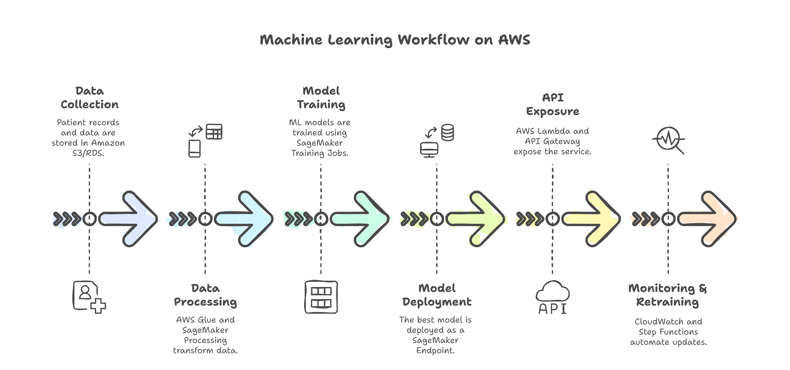

# Patient Readmission Prediction

## Project Overview
This project aims to predict patient readmissions using machine learning models. Hospitals and insurance companies can leverage this to improve patient care and reduce costs by identifying high-risk patients.

## 📂 Repository Structure
```
📦 patient-readmission-prediction
├── 📁 data                    # Sample de-identified datasets
│   ├── raw/                   # Original dataset
│   ├── processed/             # Preprocessed dataset
│   └── README.md              # Data description
├── 📁 notebooks               # Jupyter notebooks for EDA & modeling
│   ├── 01_data_exploration.ipynb
│   ├── 02_feature_engineering.ipynb
│   ├── 03_model_training.ipynb
│   ├── 04_model_evaluation.ipynb
│   └── 05_deployment_demo.ipynb
├── 📁 src                     # Source code for ML pipeline
│   ├── data_preprocessing.py
│   ├── model_training.py
│   ├── model_evaluation.py
│   ├── predict.py             # Script to test predictions locally
│   └── config.py              # Configuration settings
├── 📁 api                     # FastAPI/Flask-based REST API
│   ├── app.py                 # API endpoints for prediction
│   ├── requirements.txt       # API dependencies
│   ├── Dockerfile             # Containerization
│   └── README.md              # API usage documentation
├── 📁 deployment              # AWS deployment scripts
│   ├── terraform/             # Terraform scripts for AWS infra
│   ├── cloudformation/        # AWS CloudFormation templates
│   ├── lambda/                # AWS Lambda function
│   ├── sagemaker/             # SageMaker training & deployment scripts
│   ├── api_gateway/           # API Gateway configurations
│   ├── inference_pipeline.py  # AWS inference pipeline
│   ├── README.md              # Deployment guide
│   └── serverless.yml         # Serverless framework script
├── 📁 tests                   # Unit and integration tests
│   ├── test_data_preprocessing.py
│   ├── test_model_training.py
│   ├── test_api.py
│   └── README.md
├── 📁 models                  # Saved ML models & artifacts
│   ├── model.pkl              # Trained ML model
│   ├── model_metadata.json    # Metadata for model versioning
│   ├── feature_importance.png # Feature importance plot
│   └── README.md
├── 📁 docs                    # Documentation & reports
│   ├── project_report.pdf
│   ├── architecture_diagram.png
│   ├── business_case.pdf
│   ├── setup_guide.md
│   ├── deployment_guide.md
│   └── README.md
├── .github/workflows          # CI/CD pipeline for automation
│   ├── deploy.yml             # GitHub Actions for deployment
│   ├── test.yml               # Automated tests on push
│   ├── docker_build.yml       # Docker build pipeline
│   └── README.md
├── .gitignore                 # Ignore unnecessary files
├── LICENSE                    # Open-source license (MIT, Apache, etc.)
├── README.md                  # Project overview & setup instructions
└── requirements.txt           # Python dependencies
```

## 🚀 Getting Started

### 1️⃣ Prerequisites
- Python 3.8+
- AWS CLI installed & configured (`aws configure`)
- Docker (for containerized API deployment)
- Terraform (for AWS infrastructure automation)

### 2️⃣ Setup
Clone the repository:
```bash
git clone https://github.com/your-username/patient-readmission-prediction.git
cd patient-readmission-prediction
```

Install dependencies:
```bash
pip install -r requirements.txt
```

### 3️⃣ Running Jupyter Notebooks (for EDA & Model Training)
```bash
jupyter notebook notebooks/
```

### 4️⃣ Running the API Locally
```bash
cd api
uvicorn app:app --host 0.0.0.0 --port 8000
```

### 5️⃣ Deployment Guide
Refer to `deployment/README.md` for AWS deployment steps.



## 📜 License
This project is licensed under the MIT License.

## 🤝 Contribution
Feel free to submit issues or pull requests to improve this project!
